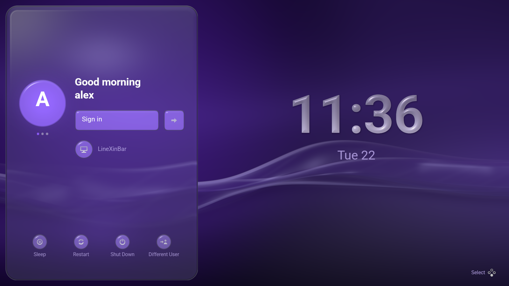
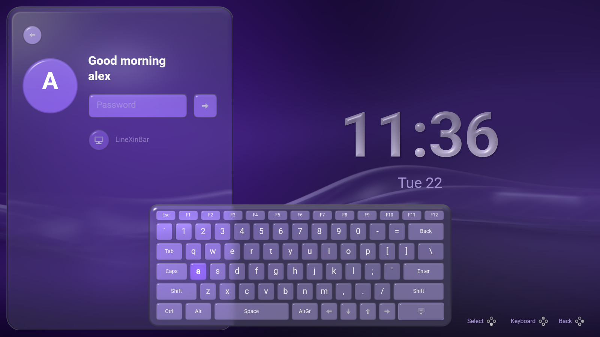
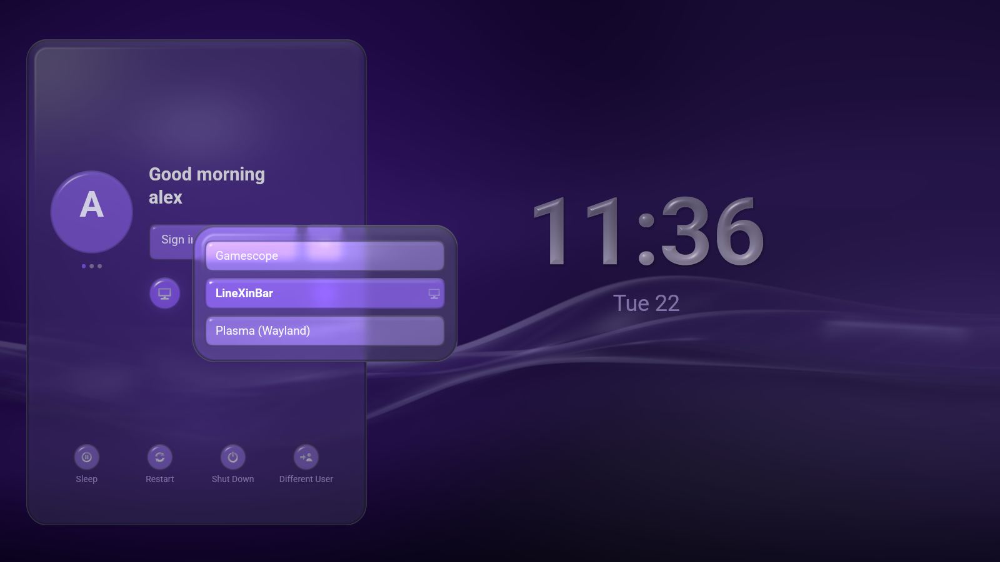

# Console Experience Desktop Manager

**A controller-first login screen for [LineXinBar](https://github.com/Petexy/LineXinBar)
and for ordinary Linux desktop sessions.**

[](LICENSE)
[](Cargo.toml)
[](Cargo.toml)



`cedm` is a greetd greeter. It draws LineXinBar's own wallpaper, palette and
glass, and it is driven by a controller, a keyboard or a pointer without any of
them being a mode. It launches any valid Wayland session entry on the machine —
LineXinBar, Plasma, anything else installed — and hands LineXinBar alone a
record that lets the wallpaper carry on at the same phase, so a login looks like
one continuous picture rather than two programs taking turns.

It is a sibling of LineXinBar but **not** built on `lxb-toolkit`: a login screen
runs before any desktop does, so everything it needs — the shader, the fonts,
the glyphs, the sounds — is compiled into the one binary. What it borrows is
[vendored and recorded](vendor/linexinbar/ORIGIN.md).

> [!WARNING]
> **Not ready to be a machine's only display manager.** The seat-owning broker,
> account enumeration beyond the local parser, the accessibility pass and
> real-VT integration tests are all still outstanding. Install and test it from
> a spare VT, or on a machine you can afford to lock yourself out of. The
> [roadmap](#roadmap) is the honest list.

## Try it without touching the machine

Preview mode never contacts greetd and never starts a session:

```sh
cargo run --release -- --windowed --preview
```

`--demo` shows made-up accounts instead of this machine's, which is what every
picture in these documents is taken with:

```sh
cargo run --release -- --windowed --demo
cargo run --release -- --demo --preview --preview-auth   # on a password prompt
cargo run --release -- --demo --preview --preview-menu   # with the session menu open
```

Write one composed frame to a PNG, for reviewing what it draws without giving
it a seat. It implies `--preview`, so it can never open a PAM conversation:

```sh
cargo run --release -- --demo --shot /tmp/cedm.png --size 1600x900
```

Look at a translation without changing what the machine is set to. It takes a
locale name or a language tag, and one this greeter is not written in is
ignored rather than fatal:

```sh
cargo run --release -- --windowed --demo --language pl
```

And list what it would offer to launch:

```sh
cargo run -- --list-sessions
```

## What it does

- **One glass column, and the time beside it.** Who is signing in, what into,
  whatever PAM is asking, and what the machine can be asked to do instead.
  Every screen puts its controls in the same rectangle, so a change of screen
  is a change of contents rather than a rearrangement.
- **A whole login screen on every display.** Two monitors are two screens, each
  with its own wallpaper, its own column at its own scale, its own clock. Both
  are the same PAM conversation, so a profile chosen on one is the profile
  shown on the other.
- **Each account in its own colour**, and each account's own picture where
  `accounts-daemon` published one. Nothing is ever read out of a home
  directory — see [what a login screen can know](docs/architecture.md#what-a-login-screen-can-know-about-an-account).
- **Controller, keyboard and pointer are one interface.** D-pad or stick moves,
  South accepts, East backs out, North raises the on-screen keyboard, the
  shoulders step between sessions. Typing on the profile screen *is* the
  password starting, and the first characters are kept rather than eaten —
  unless PAM's first question turns out to be one that echoes its answer, in
  which case what was typed too early is dropped rather than drawn in the clear.
- **An on-screen keyboard where there is nothing else to type on** — offered by
  itself only when the machine has no physical keyboard, and always available
  from the button beside the field.
- **It launches any Wayland session** by direct argument vector, never through
  a shell. Only a session authoritatively identified as LineXinBar is given the
  handover record; everything else gets the plain allowlisted environment.
- **A seamless hand-over to LineXinBar**: the wallpaper's clock continues, and
  the display is held rather than blanked between the two compositors. See
  [the handover](docs/handover.md).
- **Ten languages**, taken from whichever file this distribution keeps the
  machine's locale in.
- **Four sounds**, which are LineXinBar's own, so signing in and using the
  shell that follows are one instrument. `sound = false` turns them off.





## Install it as the display manager

Build a package for the machine and install it:

```sh
./packaging/build.sh check     # what a package would have to agree with
./packaging/build.sh arch      # makepkg
./packaging/build.sh debian    # dpkg-deb, on Debian or Ubuntu
./packaging/build.sh fedora    # rpmbuild, on Fedora
./packaging/build.sh nix       # the flake
```

Packages build under `packaging/out/build/` rather than in `/tmp`, which on
most machines is a tmpfs: this dependency graph needs about 1 GiB to compile
and roughly 4.5 GiB more for the dev-profile build the package's test phase
runs. `--work-dir DIR` sends it somewhere else.

**Installing it is the whole of becoming a display manager.** The unit carries
`Alias=display-manager.service` and every package enables it on a first
install. It will not take the login screen away from something else — only one
unit can hold that alias, so where another display manager already has it the
install says so and leaves it alone:

```text
cedm: gdm.service is already this machine's display manager, so
cedm: cedm.service has been left disabled. To switch to it:
cedm:     systemctl disable gdm.service
cedm:     systemctl enable cedm.service
```

Nothing is ever *started* by the install, because starting a display manager
takes the seat whoever ran it is signed in on; the change lands at the next
boot. An upgrade never re-enables a unit an administrator disabled.

A package installs the greeter, that unit, greetd's configuration at
`/etc/cedm/greetd.toml`, the `cedm-greeter` account and its two directories,
and one udev rule. It does **not** install an administrator policy: CEDM runs
correctly without one and its defaults are the permissive ones, so
[`contrib/config.toml.example`](contrib/config.toml.example) is installed as
documentation and a machine that wants a policy writes exactly the policy it
wants at `/etc/cedm/config.toml`.

`lxb-compositor` is a dependency — LineXinBar's compositor, packaged apart from
that project's shell precisely so that a machine with a login screen does not
thereby have a desktop it never asked for. Installing `lxb-desktop` stays
entirely the user's choice.

Everything the packaging decides, and why, is in
[`packaging/README.md`](packaging/README.md).

## Configure it

| Where | What |
| --- | --- |
| `/etc/cedm/config.toml` | The administrator's policy: which machine actions exist, whether choices are remembered, the login screen's language, `sound = false`. Unknown keys fail closed. See [`contrib/config.toml.example`](contrib/config.toml.example). |
| `/etc/cedm/greetd.toml` | greetd's own configuration, installed by the package. |
| polkit | Whether pressing Sleep, Restart or Shut down actually does anything. The greeter runs `systemctl` and logind decides; a refusal is reported rather than swallowed. |

An account's accent, theme, display and sound settings are not configured here
at all: each account publishes them for itself on its way into a session. See
[the published look](docs/handover.md#what-an-account-publishes-about-itself).

## Validate

```sh
cargo fmt -- --check
cargo test --offline
cargo clippy --offline --all-targets -- -D warnings
```

The suite includes an in-process fake greetd which checks the actual bytes on
the wire, and two checks that a translation is not a string: every sentence of
every language is shaped in the faces the greeter *ships*, into an empty font
database, and every screen is laid out in every language from 1280×720 to 4K
with each run measured against the box it was given. Unix-socket tests may need
to run outside syscall-restricted build sandboxes.

Previewing is deliberately separate from installing. A production milestone
must additionally test authentication failure and retry, logout, session
cleanup, Plasma and LineXinBar launches, multiple monitors, controller
hardware, and VT switching on a disposable machine.

## Languages

Ten, compiled in: German, English (UK), English (US), Spanish, French, Hindi,
Polish, Brazilian Portuguese, Russian and Simplified Chinese — the same ten
LineXinBar speaks. There is no catalogue under `/usr/share/locale` to be
missing and no message looked up by a name that could fail to match: a language
is a struct, so one that forgot a sentence does not build.

The language comes from the machine, because nobody has signed in yet to have a
preference — `--language`, then `/etc/cedm/config.toml`, then the environment,
then whichever of six files this distribution keeps the locale in. See
[localization](docs/localization.md).

## Documentation

| | |
|---|---|
| [`docs/design.md`](docs/design.md) | What is on the screen and why: the glass, the marks as beads of water, the clock, the avatars, the session menu, the motion, the button legend and the sounds |
| [`docs/architecture.md`](docs/architecture.md) | The layers, the greetd conversation, what a refusal says, how sessions are launched, the input contract, and the boundary around per-account data |
| [`docs/handover.md`](docs/handover.md) | The two records that make a login continuous, the three intervals that used to be black, and what an account publishes about itself |
| [`docs/localization.md`](docs/localization.md) | The ten languages, what is deliberately not translated, the clock, and how to add one |
| [`packaging/README.md`](packaging/README.md) | What a package installs and why |
| [`contrib/seamless/README.md`](contrib/seamless/README.md) | The measurements across the hand-over |

## Roadmap

1. The root seat/session broker and a minimal Smithay greeter compositor,
   keeping secrets in the unprivileged greeter and greetd conversation.
2. AccountsService/NSS enumeration, keeping the bounded "Other account" route
   for directory and hidden accounts.
3. Multi-seat preference coordination and broker-owned accent refresh.
4. A surface per output, so the column is drawn on every screen under an
   ordinary compositor and not only under one that can be configured.
5. Screen reader and accessibility semantics, and per-output scale factors.
6. The isolated X11 server and auth wrapper, then X11 session entries.
7. Nested GPU golden frames and real-VT end-to-end tests.
8. The last black interval — the one with no DRM master in it — as part of
   step 1, with golden-frame coverage of the whole hand-over.

Localisation is done, and so is composing a whole login screen on every
display.

## Licence

[GPL-3.0-only](LICENSE), matching LineXinBar and the toolkit. It releases under
the same version as LineXinBar, lxb-toolkit, Imagonsole, Videonsole, SongOnSole
and DistriBumpy.
