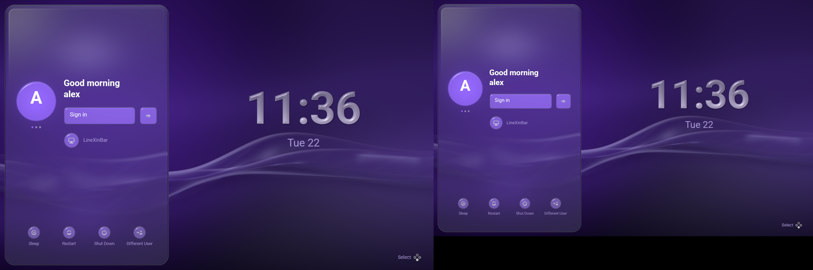

# What is on the screen, and why

This is the long answer. [The README](../README.md) is the short one.


One glass column on the left of the wallpaper, and the time on the right of it.

The column is the whole interface: who is signing in, what into, the answer PAM
is waiting for, and what the machine can be asked to do instead. Everything on
every screen stands in the same place — the field, the sign-in button and a
failure's *Try again* are one rectangle with different contents — so a screen
change is a change of content rather than a rearrangement. Only that middle band
cross-fades; the column, the identity and the bottom row belong to the greeter
rather than to any one screen, and do not move when PAM asks another question.

The wallpaper behind it is full-bleed and untouched, which is what keeps the
hand-over seamless: at the end of a login the column and the clock fade out and
the last frame the greeter draws is a wallpaper frame the session's compositor
carries on drawing at the same phase. See [the handover](handover.md).

## The glass

The column is cut from LineXinBar's **guide sidebar** rather than from its
modal-panel recipe: a shallower, clearer slab with its own light under it — a
broad glow at the head, a quieter one at the foot, and a hairline rim — so the
wallpaper's current stays visible through the glass while the controls on top
stand proud as the frostier objects. It floats clear of the display's edges for
the reason the shell gives: glass only reads as a layer when what it is laid
over runs past it.

Those numbers are vendored from `lxb-desktop`'s `sidebar_surface`. If they
change there they have to change here, or the login screen and the first shell
frame are two different materials.

**Glass is handed the greeter's own drawing as its backdrop, and nothing else.**
The wallpaper is rendered into its own target and the interface into a second
one over nothing, so a pane that looks through itself finds the panes it is
resting on and, wherever there are none, an emptiness — which the shader answers
by *evaluating* the wallpaper at whatever softness the pane's frost asks for,
rather than by blurring a picture of it.

That distinction is the whole visible difference. The wallpaper is an analytic
function of smooth, wide gradients, and blurring a picture of a smooth gradient
returns the gradient. Asking the function for its softened self is what
LineXinBar's two Wayland surfaces do, and it is why the column reads as frosted
glass rather than as a tinted rectangle. The two targets meet once, in a
compositing pass; the text is drawn onto the joined frame after it, where its
own blending is correct.

## The marks

The marks are LineXinBar's, in both senses. Ten of the thirteen are the shell's
own files: the four arrow caps, the two controller hints and the keyboard's
close key are byte-identical, and the power symbol, the restart cycle and the
session badge's screen are its `shutdown.svg`, `refresh.svg` and
`setting-display.svg` unchanged from `<svg` on, under names that say what they
do here. The greeter and the shell it hands over to must not put two different
power symbols in front of the same user four seconds apart.

**None of the thirteen is a picture of a mark.** Each file is a *silhouette* —
the body, and the openings taken out of it by one mask, in pure white with no
rim, no gradient, no sheen and no shadow anywhere in it — and what ships in the
atlas is a measurement of that outline: how far every pixel of the cell is from
the nearest edge of the mark, negative inside it. The shader builds the material
from that, and the material is a bead of water on a flat space. This is the
shell's own glyph language carried over whole; before it, these files painted
their own moulded-plastic shading by hand, and it cost them 606 lines of markup
where the outlines take 141.

What the material does with an outline is most of the argument for it. The
field's gradient points straight out of the nearest edge, so the surface turns
over wherever the mark ends — dark at the crown where the wall is edge-on to the
light and bright at the foot where it is laid down, which is the inversion that
says *liquid* rather than *plastic*. An opening costs nothing: a hole's edge is
an edge like any other, so the ring of displaced volume round the session
badge's screen is the same wall arriving from the other side, where the painted
version needed a hand-tuned pass per hole. And the field reaches out past the
mark, so the shader can ask what is up-light of a pixel *outside* it and lay the
mark's own shadow on the flat space there.

### Drawing a new one

The three this repository has to make for itself — suspend, the route to an
unlisted account, and the button that raises the on-screen board — are cut to
the same rules, and the rules are all geometry.

- **Leave a margin of two of the drawing's thirty-two units**, or the shadow
  ends in a straight cut at the cell's edge.
- **Keep no part thinner than twice the wall is deep**, or it never gets a flat
  face and comes out melted.
- **Give two bodies that are meant to read as two a real gap.** The arrow on the
  unlisted-account mark used to stand behind the figure with a drop shadow
  between them, and nothing here casts a shadow onto anything but the flat space
  beside it, so its head was shortened until the gap could be seen.

Key caps and controller hints keep their line-art *drawings*, because a cap on a
key is not an object on a shelf — but they are shaded out of the same water as
everything else, which is the part that stopped being a decision per glyph.

### The guard over the set

`lxb-desktop`'s own guard is ported with the marks, and it is what lets the ten
shared drawings be copied across without being looked at each time. Every mark
must be a shape and nothing else — pure white wherever it paints, since a rim or
a gradient left in the file would be measured as though it were geometry. Its
measurement must be *signed*, with neither the mark nor the air round it a
sliver, or there is no surface to stand a wall up on. It must leave the margin
its shadow is drawn in, checked as a ring round the cell that has to be air. And
it must be a *distance*: it may not change by more than a pixel per pixel
anywhere, which is the property that separates a field from a blurred silhouette
— a chamfer approximation fails it along the diagonals and a blur fails it
everywhere. No two may measure alike, which is what stops four arrow caps
pointing the wrong way three times out of four.

The other half of that guard is on the drawing side: the shader decides which
kind of cell a quad points at from the quad itself — square-cornered and with a
depth — so a whole login screen is composed in four phases with the board up,
and once more with the session menu open, and every quad on it is checked both
ways round. A pane that came out square would be shaded as a bead of water with
a photograph in its field, and a mark that lost its depth would be sampled as a
picture and come out a pale smear. The shell shipped that second one twice
before it had a test for it.

### Two numbers that are this atlas's own

Both follow from one fact: a cell here is 256 pixels where the shell's is 128,
because this atlas also holds photographs of people.

- **The field's gradient is read three texels out** rather than one and a half,
  since an arm is a filter width and belongs to the cell. Read at the shell's
  number it leaves the eight-bit field's own steps in the surface normal, which
  a specular of the forty-second power lays along every straight stem as a row
  of dashes.
- **The shapes are measured on a grid four times the cell**, not twice. At
  twice, a letter's edge is quantised to half a cell texel, and on a clock drawn
  at nearly the size of its own cell that is a third of a screen pixel of
  wobble.

Both were found on screen and nowhere else.

## The clock

The hour is drawn in that material too, and it is the one piece of *type* that
is. `lxb-desktop` draws the clock in the corner of its start screen as a bead of
water rather than as flat coverage, this screen hands over to that one within a
few seconds, and two readings of the same material in front of the same person
is the seam this whole project exists to avoid.

So every character either clock can contain — the ten digits, the colon, and
the `A`, `M` and `P` of an afternoon, with a space that moves the pen and draws
nothing — is cut out of the bundled bold Roboto once at start, measured into a
signed distance field, and drawn as one quad per letter through the shell's own
`glyph_material`. A time holding anything outside that alphabet is drawn as no
clock at all, which is why the tests walk both clocks through all twenty-four
hours; see [the clock](localization.md#the-clock). They are tinted with the accent's own pale cast rather than the
near-white the rest of the interface is lettered in, because the clock stands on
the wallpaper with nothing behind it and it is the one thing on this screen that
says which palette the account being signed into keeps.

**The second line under it cannot follow and is not meant to.** It is *words*, in
ten languages, in Latin, Cyrillic, Devanagari and Han — a cell per codepoint is
not a text renderer, and Chinese alone would want a thousand of them. It stays a
text run in the same tint, which is what keeps the two lines one object: the
colour carries the accent, the material carries the hour.

## Avatars

Each account is shown with its own picture where the system has published one.
`accounts-daemon` keeps a copy of every user's chosen avatar at
`/var/lib/AccountsService/icons/<name>`, world-readable on purpose: that
directory exists so a login screen — which runs as nobody in particular — can
show a face without being handed a way into anybody's home. GDM reads it and so
does every other display manager that shows one. It is not a privilege the
greeter has; it is a copy the system published.

Which is why **nothing goes near `~/.face`**. That is the *source* the daemon
copied from, it sits inside a home directory the greeter has no business in —
unreadable anyway on a good many distributions — and reaching for it would cross
precisely the boundary this project draws around per-user configuration
everywhere else. An avatar that never reached AccountsService is an account with
no picture here, and the initial stands in for it.

The picture is centre-cropped to a square and box-filtered down into a cell of
the atlas, once, as the window is made: cropped rather than squeezed because the
shape it is going into is a circle and portraits are framed on the middle;
box-filtered because this only ever shrinks, and taking the nearest source pixel
instead is how an avatar comes out looking photographed through a screen door.
Only PNG is decoded — the daemon does not transcode what it copies, so an avatar
set from a JPEG stays a JPEG, and that account keeps its initial rather than the
greeter growing a second image decoder to run over a file before anyone has
logged in. Cells are bounded at seventeen accounts and the read at 8 MB, because
everything on this side of a login is.

## The carousel

It is still a carousel — left and right move between accounts — but it shows one
profile at a time, sliding, because the column cannot clip what it holds. The
dots under the avatar count *enumerated accounts*, so a machine with one account
has no dots: the route for an account the greeter cannot enumerate is a button
on the bottom row, not a page of the ring, and counting it would tell a
single-user machine it has two profiles.

## The session menu


Choosing a session opens a menu in the same language the shell's own context
menus use: beside the badge it is about rather than over it, grown out of it,
dimming what it stands in front of, with the session already chosen keeping its
mark whichever row the cursor is on. It owns every direction while it is up,
exactly as the on-screen keyboard does, and a press anywhere outside it is an
answer of "not this". The shoulder buttons still step straight between sessions
without opening anything.

Its panel is cut from the column's own glass — the same four quads, the same
depth, gloss and face curve — because the shell cuts its context menus from the
guide sidebar for the same reason: a menu is a quiet pane with things to press
laid on it, not a question that takes the screen over. The modal recipe, which
is the near-opaque slab the on-screen keyboard rests under, would have hidden
the one thing this panel is standing on. The one number it parts on is the
frost, which is cut deeper: the shell keeps its sidebar clear for a reason about
*size* — a surface two thirds of the display tall, frosted hard, turns almost
all of its face into one flat field — and a pane of three rows has no face to
lose and a job the column has not got, which is to be read against the column
itself, a few pixels behind it and in the same violet.

**While it is up the whole screen steps back from the viewer** — the column, the
clock, the wallpaper's furniture, all of it scaled down about the badge the
panel came out of, which is the one thing that does not move. Shrinking towards
the middle of the display instead would slide that badge out from under the very
panel growing off it, which reads as the column sliding rather than as the
column receding. Glass depth is a length like any other and goes back with
everything else: a slab left at full thickness on a screen that had moved away
would be a bevel that grew as the screen shrank. It rides the panel's own
arrival, so the screen goes back over exactly the span the panel comes forward
in, and it is a distance the screen *holds* rather than a flourish — a push that
only reads while it is moving has stopped saying anything by the time the user
is reading the list.

**Frost alone cannot make it readable**, because text is one pass after every
quad: a label is not covered by a panel drawn over it, it is drawn *afterwards*,
whatever the panel is made of. So the panel takes the writing it covers away —
one run in, up to three out, the pieces either side of it kept where they were
and the piece under it faded out over the panel's arrival. That is the shell's
`cut_text_behind`, and it is what stops the session's own name reading straight
through the rows naming sessions. The cut is measured against the line rather
than against the box a run was laid out in, so a label standing plainly above
the panel is not taken away because the empty bottom of its box dips under an
edge.

## Every display is a display



A machine with two monitors on it has two screens, not one wide one, and the
greeter draws a whole login screen on each: its own wallpaper, its own column at
its own scale, its own clock, its own board. Either screen can be signed in on,
and both are the same conversation — there is one PAM exchange behind them, so a
profile chosen with the pointer on the right-hand monitor is the profile shown
on the left one.

That has to be arranged for, because it is not what the greeter is handed. CEDM
is a Wayland client with a single surface, and the compositor that gives it that
surface extends it across the whole output layout: one buffer as wide as every
monitor put together, with the seam between two of them somewhere in the middle.
Laid out as one screen — which is what a client that never asks does — that is a
wallpaper stretched over two panels of different shapes, a column pinned to the
outer edge of the left-hand one, a clock in the gap between them, and every
length in the interface scaled to a screen nobody owns.

So the surface is cut back into the displays it was made of and each one is
composed on its own, in its own pixels, from its own corner. **The compositor's
layout is believed only when it accounts for the surface exactly** — every
output a rectangle of its own, none overlapping another, their bounding box the
size of the surface. An output the layout names more than once is one output:
winit reports every screen twice, and counted twice a screen stands on itself,
which is a mirrored pair by every rule that looks only at geometry. A nested
development window on a desktop, a mirrored pair, an output whose mode has been
announced but not applied: each of those is answered with the whole surface as
one display, which is what the greeter did before it could count displays and is
never wrong on screen, only wide. A strip of surface no monitor is behind — the
space under a shorter screen standing beside a taller one — is drawn on by
nobody and stays black, because that is what is in front of the user there.

The wallpaper in particular has to be per display, and not only because a
stretched gradient looks stretched. LineXinBar gives every output its own layer
surface and evaluates the wallpaper against that output's own size, so a greeter
that evaluated one across all of them would be handing over a picture the shell
is about to replace with a different one on every screen. **The seamless frame is
only seamless per display.** Glass is asked the same question the same way: a
pane carries the display it stands on, and where it finds nothing drawn behind
it, the wallpaper it falls through to is that display's. It is also cut to that
display's bounds — the light under an avatar is drawn wider than the avatar, and
on a single screen the edge of the framebuffer takes care of the overhang, while
on a row of monitors what is out there is the next screen along.

What is still ahead of this is a *surface per output* rather than one surface
cut up, which is what would let the column be drawn on every screen under an
ordinary fullscreening compositor as well.

## The motion

- **Profile changes slide beneath a stationary selection light** and can be
  retargeted while moving.
- **Screen changes keep the outgoing and incoming compositions together** for a
  280 ms eased hand-off instead of replacing one whole screen in a single frame.
  The on-screen keyboard keeps its own solid rise and lower.
- **The login screen rises into view over 600 ms** from its first frame, on a
  smoothstep — symmetrical, so it leaves at the same rate and the halfway point
  of the time is the halfway point of the picture. A linear fade arrives by
  stopping, which reads as a cut however long it is given.

What rises is everything the greeter draws, and **nothing of the wallpaper**.
That is the only shape this can take: the wallpaper is on the screen before this
program has a window — the compositor draws it, at the phase a scene clock kept
across the hand-over — so a rise that began from black would have to lay black
over a picture that is already there, and the display would drop to black and
come back rather than arrive. What was missing was never the picture; it was
everything in front of it. Measured across the rise, the wallpaper moves by at
most one 8-bit level, which is rounding.

It is longer than every other movement here because it is the only one that is
not an answer to something the user did — nobody is waiting on it. For the same
reason it dims the picture and never the controls: a screen that is still
arriving is a screen that works, and somebody who starts typing their password
into the first half-second of it has every character. Only a departure takes the
controls away. `--shot` captures a fully arrived frame, since a picture of a
login screen a fraction into its own entrance is a picture of nothing much.

## What the buttons do, written in the corner

The bottom-right corner of the wallpaper carries a row of the presses this
screen answers: a word, and a picture of the button that does it. `Select`,
`Keyboard` and `Back`, read left to right.

It is in that corner because it is in that corner one press later. LineXinBar
writes its own legend opposite the thing the screen is about, and the login
screen and the shell's start screen are either side of a hand-over that is
otherwise seamless; a hand that has learnt where to look for this row must not
have to learn it again. It is written in the clock's ink — the accent's own pale
cast — because the clock and the row are the only two things this screen puts on
the wallpaper.

**The button is drawn rather than named.** The same act is South on a pad and
Enter on a keyboard, and no wording covers both without naming neither — "press
A" is wrong on a PlayStation pad and meaningless to somebody typing. So the row
draws whichever control is in the user's hands, and it draws a pad by *position*
rather than by letter: A/B/X/Y are swapped between Xbox and Nintendo pads and
mean nothing at all on a PlayStation one.

Which control that is starts as the account's own answer — `controller-in-hand`
out of its published look, which is the shell's record of what that person last
reached for — and is settled outright by the first press this greeter itself
sees. A pad press makes it a pad, a key makes it a keyboard, and it stays
settled across the carousel: somebody typing who pages to the next account is
not shown a controller because *that* account's last session was played with
one.

**It names no button that does nothing.** `Keyboard` is there only where there
is a field to type into, and only on a pad. `Back` is there exactly where the
arrow at the head of the column is, asked of the same phase, so the two cannot
disagree about whether there is a way out.

**The corner is shared with the keyboard**, and gives up only what the board
actually takes. The board is drawn in the middle of the display and is narrower
than a wide one, so what is left beside it is a distance rather than a yes or a
no: the row keeps as much of the corner as there is and is drawn smaller — never
below eleven twentieths — before it gives up a pair, and the pair it gives up is
the last. A display too narrow for the clock has no wallpaper beside the column
at all, and carries no row, exactly as it carries no clock. An open session menu
takes the row away whole, as a context menu does in the shell.

**It is off where the account turned it off.** `button-hints` is one key in
`shell.toml`, written by Settings ▸ System ▸ Button hints, and it is already the
one key in that file the shell's own *applications* read for their legends. A
session with the hints off is a session with them off everywhere, and this
screen is not the exception. Nothing on the screen is measured against the row,
so switching it off moves not one pixel of the interface.

## What a button sounds like

Four recordings, and they are LineXinBar's own — copied into `assets/sounds/`,
recorded in [`vendor/linexinbar/ORIGIN.md`](../vendor/linexinbar/ORIGIN.md), and
shipped in the binary for the same reason the fonts and the glyphs are: a login
screen runs before any desktop does, and there may be no theme of sounds on the
machine to borrow one from. Signing in and using the shell that follows are
meant to be one instrument.

| When | Clip |
| --- | --- |
| the highlight arrives somewhere new | `press-guide.ogg` |
| a press this screen acts on | `press-selected.ogg` |
| a key of the on-screen keyboard going down | `keyboard-click.ogg` |
| a password refused | `error.ogg` |

Three rules decide the rest of it.

**Only a button.** The pad and the keys that drive the column make these noises;
a pointer makes none of them. That is what the sounds are for — a click is the
half of the acknowledgement that reaches somebody looking at the pad in their
hands rather than at the screen — and a mouse is a control the user is watching
the whole time. A swept pointer would otherwise be a stream of clicks answering
a question nobody asked. It is structural rather than remembered: every one of
them is spent around `apply_action`, and `click`/`hover` do not reach the sound
module at all.

**Only what happened.** A direction that moved nothing is silent — the end of a
row that will not wrap, a carousel holding one profile — and so is a press on a
control that did nothing. A click for either would stop meaning "you moved" and
start meaning "the button is not broken". A press that goes *backwards* is not
one of those: leaving a prompt and putting the board away are things somebody
asked for and got.

**The refusal is the exception**, and it is why it is here at all. It answers no
press — it arrives from PAM, whole seconds after the answer went away, very
often at somebody who typed a password they know by heart and then looked
somewhere else. Only PAM's refusal: a failure of the login service puts the same
red screen up, but nothing the user types will fix that one, and answering both
the same way would teach the noise to mean nothing. Physical typing into the
field is silent too; `keyboard-click.ogg` belongs to the on-screen board, which
is its own instrument.

An administrator turns all of it off with `sound = false` in
`/etc/cedm/config.toml`; `--no-sound` is the same switch for somebody running
the preview on their own desktop. The greeter reaches the sound card the way it
reaches every other device on its seat — logind's ACL, not the `audio` group —
and one whose seat was never granted it logs `no audio output` once and goes on
in silence, which is a working login screen.

Which speakers, and how loud, is the account's to say rather than the greeter's
to guess: see [the published look](handover.md#sound).

## Where the pictures come from

`--demo` shows three made-up accounts instead of this machine's, because a
picture of a login screen is otherwise a picture of whoever took it: the
carousel draws login names out of `/etc/passwd` and the face `accounts-daemon`
published for each one. None of the three has an avatar, which is honest rather
than a shortcut — inventing a face would mean shipping a photograph of a person
who does not exist, in the one place on the screen where a real machine shows a
real one.

```sh
cedm --demo --shot docs/screen.png      --size 1600x900
cedm --demo --preview --preview-auth --shot docs/keyboard.png --size 1600x900
cedm --demo --preview --preview-menu --shot docs/sessions.png --size 1600x900
cedm --demo --size 2400x800 --displays 1280x800+0+0,1120x700+1280+0 \
     --shot docs/two-screens.png
```

The accent in them is the fallback palette, which is what an account that has
published nothing is drawn in — so the pictures state nothing about the machine
they were taken on. `--shot` still needs a window to obtain a GPU surface, so it
is a development aid rather than a headless renderer.
